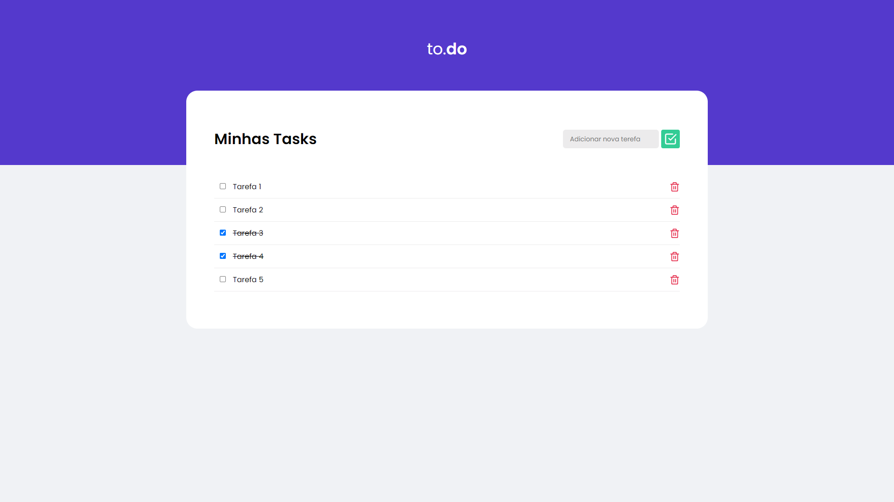

## 📖 Projeto

O projeto foi criado usando o boilerplate, create-react-app. A finalidade do projeto foi colocar em prática alguns conhecimentos adquiridos durante o estudo de ReactJS. O template apesar de básico, foi inspirado em um desafio da Rocketseat e codado totalmente por mim utilizando styled-components. A biblioteca UUID foi utilizada para gerar o identificador único de cada tarefa adicionada. 

## 🧪 Tecnologias

Esse projeto foi desenvolvido com as seguintes tecnologias e bibliotecas: 

- [React](https://reactjs.org)
- [Styled-components](https://styled-components.com/)
- [UUID](https://www.npmjs.com/package/uuid)

## 🚀 Como executar

Clone o projeto e acesse a pasta do mesmo.

```bash
$ git clone https://github.com/d0ugui/to-do.git
$ cd to-do
```

Para iniciá-lo, siga os passos abaixo:

```bash
# Instalar as dependências
$ yarn

# Iniciar o projeto
$ yarn start
```

O app estará disponível no seu browser pelo endereço http://localhost:3000/

## 📝 License

Esse projeto está sob a licença MIT. Veja o arquivo [LICENSE](LICENSE.md) para mais detalhes.